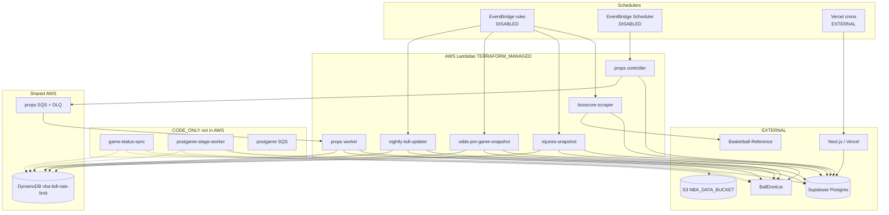
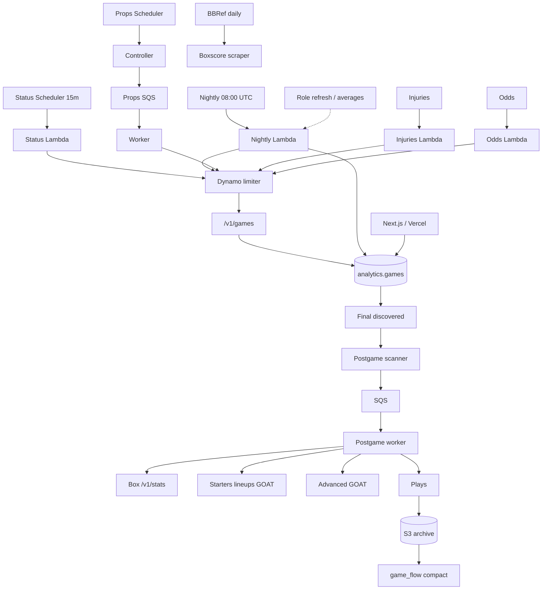

# Court Context Terraform / AWS Architecture Overview

**Step:** 13I.1 (read-only audit)  
**Date:** 2026-09-10  
**Verdict:** `YELLOW — architecture is sound but Terraform/apply boundaries need cleanup`

This document is the architecture reference for Court Context’s AWS ingestion stack. It is based on `infra/` HCL, local Terraform state (`terraform state list`), bounded AWS `Get*` / `Describe*` of known names, and `scripts/ops/aws-ingestion-status.ts`. **No apply, deploy, invoke, SQS send, or provider HTTP was performed in this step.**

---

## Executive summary

1. **What does Terraform own?**  
   The single AWS ingestion control plane in `us-east-1`: six production Lambdas, their IAM, EventBridge rules / Scheduler schedules, the props SQS pair, DynamoDB BDL limiter, and a subset of CloudWatch alarms. It also owns **CODE_ONLY** definitions for frequent game-status sync, postgame queues/worker, and additional alarms.

2. **What does Terraform not own?**  
   Supabase Postgres, Vercel/Next.js hosting, historical S3 (`NBA_DATA_BUCKET`), BallDontLie, Basketball-Reference, DNS, Umami, Stripe, and secrets stores (none exist). Those are external. Terraform only *injects* Postgres URLs and BDL keys into Lambda env from gitignored tfvars.

3. **How many major Lambda families exist?**  
   **Eight function definitions** in HCL, mapping to **six deployed** families plus **two not deployed**: nightly BDL, injuries, game odds, props controller, props worker, BBRef boxscore, plus CODE_ONLY status-sync and postgame worker.

4. **How are they triggered?**  
   EventBridge **rules** (nightly, odds ×9, injuries, boxscore), EventBridge **Scheduler** (props controller crons), SQS **event-source mapping** (props worker; postgame ESM defined but not deployed). Status-sync Scheduler is HCL-only. Vercel crons (`paper-settle`, `prune-props`) are **not** this Terraform stack.

5. **Where does data land?**  
   Live Lambdas write **Supabase** `raw.*` then `analytics.*`. Historical/deep archive is **S3** (`NBA_DATA_BUCKET`), used by scripts and future postgame plays → `game_flow`, **not** provisioned by this Terraform. Serving UI reads Postgres from Vercel.

6. **What shared infrastructure exists?**  
   DynamoDB table `nba-bdl-rate-limit`, freeze locals (`live_ingestion_enabled` + `DATA_MODE`/`OFFSEASON_MODE`/`CRON_DRY_RUN`), copied `fetchBdlLive` limiter, identity SQL copies, Final-preserve SQL in domain libs.

7. **What is deployed?**  
   Nightly, odds, injuries, props controller/worker, boxscore, props queues, limiter table, most existing alarms, all listed EventBridge/Scheduler triggers (in **DISABLED** state). Props worker ESM is **enabled** (queue consumer).

8. **What is frozen?**  
   Global `live_ingestion_enabled=false`. All ingestion **schedules** DISABLED. Lambda env `DATA_MODE=replay`, `OFFSEASON_MODE=1`, `CRON_DRY_RUN=1`. Product pin 2025. GOAT inactive. `/v1/stats` blocked by subscription.

9. **What is code-only?**  
   `game-status-sync` Lambda + schedule + Errors alarm; postgame queue/DLQ/worker/ESM/DLQ alarm; injuries Errors alarm; props DLQ alarm. Packaged in git, **absent from Terraform state and AWS** (confirmed for status-sync function and postgame queue).

10. **Is a full Terraform apply currently safe?**  
    **No.** Schedules would stay DISABLED (activation-safe), but a normal apply would **create unfinished postgame + status-sync resources**, **push local zip-hash updates onto live Lambdas**, and add CODE_ONLY alarms. Classify: **RISKY**.

**Recommended next action:** `13I.2 — Terraform hygiene / apply-boundary cleanup` (do not start it here). Do not jump to 13C.3A until a full apply cannot accidentally deploy unfinished families.

---

## 1. Terraform tree inventory

`infra/` is a **flat root module** (no `modules/`). Providers: `hashicorp/aws ~> 5.0`, `hashicorp/archive ~> 2.0`. Region: `var.aws_region` (tfvars `us-east-1`).

| File | Role |
| --- | --- |
| `main.tf` | required_providers; **S3 backend commented out** (local state) |
| `provider.tf` | AWS provider, region from variable |
| `variables.tf` | shared + per-family names, sizes, crons, `live_ingestion_enabled`, reserved-concurrency flags |
| `lambda.tf` | freeze locals; nightly, odds, injuries, props, boxscore Lambdas + schedules + props SQS/ESM |
| `iam.tf` | execution roles, log attachments, props SQS policies, props scheduler invoke role |
| `bdl-rate-limit.tf` | Dynamo table, limiter env/IAM locals, per-Lambda limiter policies |
| `monitoring.tf` | CloudWatch alarms (mix of deployed + CODE_ONLY) |
| `game-status-sync.tf` | CODE_ONLY frequent `/v1/games` Lambda + optional Scheduler |
| `postgame.tf` | CODE_ONLY postgame SQS + DLQ |
| `postgame-worker.tf` | CODE_ONLY worker Lambda + ESM (`enabled = var.live_ingestion_enabled`) |
| `outputs.tf` | names/ARNs/URLs/alarm names |
| `terraform.tfvars` | **gitignored** live values + freeze flags (do not commit) |
| `terraform.tfvars.example` | documented shape without real secrets |
| `README.md` | operator guide (partially stale vs 13C/13F files) |
| `*.json` | local invoke payload fixtures, not AWS resources |

**Not present in HCL:** `aws_s3_bucket`, `aws_cloudwatch_log_group`, `aws_secretsmanager_*`, `aws_ssm_parameter`, `vpc_config`, `tags`, remote backend, Terraform Cloud.

**Packaging:** `data.archive_file` zips `lambda/<name>/` (or `.package` for status-sync). Hash is `source_code_hash`. Operators must `npm install && npm run build` (status-sync: `npm run build:game-status-sync-lambda`) **before** apply.

---

## 2. Ownership model

| Component | Class | Evidence |
| --- | --- | --- |
| Deployed Lambdas, IAM, EventBridge, Scheduler, props SQS, Dynamo limiter, in-state alarms | **TERRAFORM_MANAGED** | In HCL **and** `terraform state list` **and** AWS GetFunction / GetQueueUrl / DescribeTable |
| Status-sync Lambda/schedule/alarm | **CODE_ONLY** | In HCL; **not** in state; GetFunction `ResourceNotFoundException` |
| Postgame queues/worker/ESM/DLQ alarm | **CODE_ONLY** | In HCL; **not** in state; GetQueueUrl `NonExistentQueue` |
| Injuries Errors alarm, props DLQ alarm | **CODE_ONLY** | In HCL; **not** in state; DescribeAlarms did not return them |
| Supabase, Vercel, S3 archive, BDL, BBRef, Umami, Stripe, DNS | **EXTERNAL** | No corresponding `resource` blocks |
| CloudWatch log groups `/aws/lambda/<fn>` | **EXTERNAL** (AWS default) | Lambda basic execution creates them; Terraform does not manage retention |
| Operator AWS IAM user/role used for `terraform` / ops scripts | **EXTERNAL** | Not in this stack |
| Limiter **source copies** in each Lambda folder | **LEGACY / UNCLEAR** as packaging, not as AWS | Canonical `lambda/shared/`; copies kept in sync by drift tests. Status-sync instead **bundles** shared lib. |

Do not treat “defined in HCL” as deployed.

---

## 3. What Terraform does **not** own

| External | How AWS interacts | Terraform references it? | Manages lifecycle? |
| --- | --- | --- | --- |
| **Supabase Postgres** | Lambdas open outbound TLS to `SUPABASE_DB_URL` (pooler). No VPC/NAT. | Env maps only | **No** |
| **Vercel / Next.js** | Browser/API read Supabase. `vercel.json` crons: `/api/cron/paper-settle`, `/api/cron/prune-props` | None | **No** |
| **S3 archive (`NBA_DATA_BUCKET`, example `nba-analytics-data`)** | Archive/materialize **scripts** and future postgame plays; Lambdas in this stack have **no S3 IAM** | Env on Vercel/CLI, not `infra/` | **No** |
| **BallDontLie** | HTTPS `api.balldontlie.io` via `fetchBdlLive` | API key in tfvars → Lambda env | **No** (subscription/entitlement external) |
| **Basketball-Reference** | boxscore Lambda HTTP scrape | Delay env only | **No** |
| **Secrets Manager / SSM** | **Not used**. Docs mention them as future | None | **No** |
| **DNS / domain** | Product hostname is Vercel/DNS elsewhere | None | **No** |
| **Umami** | Optional `NEXT_PUBLIC_UMAMI_*` in Next.js | None | **No** |
| **Stripe** | Billing in the Next app | None | **No** |

---

## 4. Resource-family inventory

| Family | Terraform resources | Runtime role | Deployed? | Enabled? | Provider dependency | Data destination |
| --- | --- | --- | --- | --- | --- | --- |
| Nightly BDL | `aws_lambda_function.nightly_bdl_updater`, EventBridge `nightly-bdl-updater-daily`, IAM, limiter policy, Errors alarm | Schedule + `/v1/games` + `/v1/stats` + transforms | **Yes** | Schedule **DISABLED**; fn Active | BDL ALL-STAR (`/v1/stats` **BLOCKED_BY_SUBSCRIPTION**) | `raw.games`, `raw.player_game_stats`, `raw.players` → `analytics.games`, PGL, team/player averages |
| Frequent game-status | `game_status_sync` Lambda, optional Scheduler `nba-game-status-sync-schedule`, limiter IAM, Errors alarm | 15m `/v1/games` status/scoreboard | **No** (CODE_ONLY) | Schedule not created | BDL `/v1/games` **AVAILABLE** | `analytics.games` only (designed) |
| Injuries | `injuries_snapshot` + EventBridge `injuries-snapshot-schedule` | `/nba/v1/player_injuries` | **Yes** | Schedule **DISABLED** | BDL injuries (certified separately) | `raw.player_injuries*` → `analytics.player_injury_*` |
| Game odds | `odds_pre_game_snapshot` + 9 EventBridge rules | `/v2/odds` | **Yes** | All **DISABLED** | BDL odds | `raw.odds_*` → `analytics.game_odds_*` |
| Props controller | `player_props_controller` + Scheduler `nba-player-props-{0,1,2}` | Discover ET games, enqueue SQS | **Yes** | Schedules **DISABLED** | **Postgres only** (no BDL) | SQS messages |
| Props worker | `player_props_worker` + ESM | `/odds/player_props` per game | **Yes** | **ESM enabled**; idle if queue empty | BDL props | `raw.player_prop_*` → `analytics.player_props_*` |
| Props queue / DLQ | `nba-player-props-game-queue`, `nba-player-props-game-dlq` | Fanout + retries | **Yes** | Queue exists; producer frozen | — | — |
| BBRef | `boxscore_scraper` + EventBridge `boxscore-scraper-daily` | HTML box scrape | **Yes** | Schedule **DISABLED** | Basketball-Reference | analytics box tables (Lambda-owned) |
| BDL limiter | `aws_dynamodb_table.bdl_rate_limit` | Account token bucket | **Yes** | Active table | — | Coordination only, not serving data |
| Postgame queue / DLQ | `nba-postgame-stage-queue`, `nba-postgame-stage-dlq` | Future Final fanout | **No** | — | — | — |
| Postgame worker | `postgame_stage_worker` + ESM | Box / starters / Advanced / plays | **No** | ESM would be `enabled=false` while frozen | BDL GOAT paths **blocked**; `/v1/stats` blocked | Postgres + S3 plays (designed, not live) |
| CloudWatch alarms | See §19 | Errors / custom / DLQ | **Partial** | Existing alarms quiet (`notBreaching` except noted drift) | — | — |

---

## 5. Actual AWS state (known names only)

Classification key: **DEPLOYED_ACTIVE** (executing path on), **DEPLOYED_DISABLED** (exists, schedule/ESM off), **DEPLOYED_IDLE** (exists, trigger on but no work), **CODE_ONLY_NOT_DEPLOYED**, **TERRAFORM_DEFINED_STATE_UNKNOWN**, **EXTERNAL**.

| Resource | Classification | Evidence |
| --- | --- | --- |
| Six core Lambdas | **DEPLOYED_DISABLED** (schedules) / functions **Active** | GetFunction + ops snapshot `exists: true`, `scheduleObserved: DISABLED` |
| Props worker ESM | **DEPLOYED_ACTIVE** (consumer on) | HCL has no `enabled=false`; 13C.3 plan no-op `State=Enabled`. Last invocation 2026-09-06 → **idle** |
| EventBridge nightly/odds/injuries/boxscore | **DEPLOYED_DISABLED** | State list + ops `DISABLED` |
| Scheduler `nba-player-props-0..2` | **DEPLOYED_DISABLED** | State + ops |
| Props SQS + DLQ | **DEPLOYED_IDLE** | State + GetQueueUrl success; ops script returned UNKNOWN (telemetry gap, not absence) |
| Dynamo `nba-bdl-rate-limit` | **DEPLOYED_ACTIVE** | DescribeTable `ACTIVE` |
| Alarms nightly/odds/boxscore/props custom | **DEPLOYED_IDLE** | In state; nightly DescribeAlarms `notBreaching` |
| Status-sync function/schedule/alarm | **CODE_ONLY_NOT_DEPLOYED** | Not in state; GetFunction not found |
| Postgame queue/worker | **CODE_ONLY_NOT_DEPLOYED** | Not in state; queue does not exist |
| Injuries Errors, props DLQ, postgame DLQ alarms | **CODE_ONLY_NOT_DEPLOYED** | HCL only / not in state |
| S3 / Supabase / Vercel | **EXTERNAL** | — |

Ops snapshot (2026-09-10): overall `scheduleObserved: DISABLED`. Recent Lambda invocations while schedules were DISABLED are **manual/canary**, not scheduler thaw.

---

## 6. HCL vs state vs AWS

```text
HCL (infra/*.tf)
    vs
Local terraform.tfstate  (gitignored; no remote backend)
    vs
AWS us-east-1 (bounded Get/Describe)
```

| Bucket | Items |
| --- | --- |
| **State + AWS** | Nightly, odds, injuries, props pair, boxscore, props queues, limiter, in-state EventBridge/Scheduler, in-state alarms |
| **HCL only** | Entire `game-status-sync.tf`, `postgame.tf`, `postgame-worker.tf`, four monitoring alarms |
| **AWS but not this state** | Default log groups; possibly other account resources **not audited** (no account-wide scan) |
| **Drift (do not fix here)** | See §27: zip-hash churn; `player_props_controller_low_coverage` `treat_missing_data` breaching→notBreaching in HCL vs AWS; CODE_ONLY creates |
| **Orphan candidates** | None proven. Props queue exists in AWS and state |
| **Stale references** | `infra/README.md` omits status-sync/postgame; ops catalog lists odds rules `0–4` but **nine** rules `0–8` exist; catalog lists `nba-player-props-schedule` but production uses crons `nba-player-props-0..2` |

---

## 7. High-level architecture



Dashed edges are designed, not deployed.

---

## 8. Ingestion families (detailed)

```mermaid
flowchart TB
  subgraph status [Game status CODE_ONLY + FROZEN]
    S1[Scheduler rate 15m NOT CREATED] --> S2[game-status-sync NOT_DEPLOYED]
    S2 --> L[Limiter]
    L --> G["BDL /v1/games AVAILABLE"]
    G --> A1[analytics.games]
  end

  subgraph nightly [Nightly DEPLOYED + FROZEN]
    N1[EventBridge 08:00 UTC DISABLED] --> N2[nightly-bdl-updater]
    N2 --> L2[Limiter]
    L2 --> NG["/v1/games"]
    L2 --> NS["/v1/stats BLOCKED_BY_SUBSCRIPTION"]
    NG --> RAW[raw.games / PGL]
    NS --> RAW
    RAW --> AN[analytics.*]
  end

  subgraph injuries [Injuries DEPLOYED + FROZEN]
    I1[EventBridge 13/18/22 UTC DISABLED] --> I2[injuries-snapshot]
    I2 --> L3[Limiter]
    L3 --> INJ["/nba/v1/player_injuries"]
    INJ --> APG[analytics injury tables]
  end

  subgraph odds [Odds DEPLOYED + FROZEN]
    O1[EventBridge x9 DISABLED] --> O2[odds-pre-game-snapshot]
    O2 --> L4[Limiter]
    L4 --> OD["/v2/odds"]
    OD --> AOD[analytics.game_odds_*]
  end

  subgraph props [Props DEPLOYED + FROZEN producer]
    P1[Scheduler nba-player-props-0..2 DISABLED] --> P2[controller]
    P2 --> SQS[SQS DEPLOYED]
    SQS --> P3[worker ESM ENABLED]
    P3 --> L5[Limiter]
    L5 --> PP["/odds/player_props"]
    PP --> APP[analytics.player_props_*]
  end

  subgraph bbref [BBRef DEPLOYED + FROZEN]
    B1[EventBridge daily DISABLED] --> B2[boxscore-scraper]
    B2 --> HTML[Basketball-Reference HTML]
    HTML --> ABX[analytics box]
  end

  subgraph postgame [Postgame CODE_ONLY + PARKED]
    SC[Scanner CLI not TF] -.-> PQ2[SQS NOT_DEPLOYED]
    PQ2 -.-> W[worker NOT_DEPLOYED]
    W -.-> BOX["/v1/stats BLOCKED"]
    W -.-> ST["lineups GOAT inactive"]
    W -.-> ADV[Advanced GOAT]
    W -.-> PL[Plays then S3 then game_flow]
  end
```



---

## 9. Terraform responsibility boundaries

Terraform **does** own: resource lifecycle for the listed AWS objects, scheduler **definitions**, Lambda **configuration** (runtime, memory, timeout, env merge, hash), IAM, props queue/DLQ lifecycle, limiter table, a subset of alarms, freeze **schedule state** via `local.ingestion_schedule_state`.

Terraform **does not** own: Postgres schema/migrations, S3 buckets, Vercel, log retention, secret rotation, DNS, product pin (`PINNED_ANALYTICS_SEASON` in `lib/season.ts`), BDL subscription.

**Manual today:** Lambda `npm run build` before apply; tfvars secret paste; canary invokes; 13G ops scripts; identity/SQL migrations; archive jobs to S3; Vercel env.

---

## 10. Lambda inventory

| TF resource | AWS name | Artifact | Runtime | Mem | Timeout | Arch | Trigger | Cadence | Provider | Limiter | Writes | IAM | Deployed | Activation |
| --- | --- | --- | --- | --- | --- | --- | --- | --- | --- | --- | --- | --- | --- | --- |
| `nightly_bdl_updater` | `nightly-bdl-updater` | zip `lambda/nightly-bdl-updater` | nodejs22.x | 512 | 300 | x86_64 | EventBridge | daily 08:00 UTC | `/v1/games`, `/v1/stats` | yes | raw+analytics | logs+DDB | DEPLOYED | FROZEN |
| `odds_pre_game_snapshot` | `odds-pre-game-snapshot` | zip `lambda/odds-pre-game-snapshot` | nodejs22.x | 512 | 300 | x86_64 | EventBridge ×9 | morning ET window | `/v2/odds` | yes | raw+analytics | logs+DDB | DEPLOYED | FROZEN |
| `injuries_snapshot` | `injuries-snapshot` | zip `lambda/injuries-snapshot` | nodejs22.x | 256 | 120 | x86_64 | EventBridge | 3× UTC | `/nba/v1/player_injuries` | yes | raw+analytics | logs+DDB | DEPLOYED | FROZEN |
| `player_props_controller` | `nba-player-props-controller-lambda` | zip `lambda/player-props-snapshot` `dist/controller.handler` | nodejs22.x | 256 | 120 | x86_64 | Scheduler ×3 | ET morning crons | none (SQL) | **no** | SQS send | logs+SQS send | DEPLOYED | FROZEN |
| `player_props_worker` | `nba-player-props-ingestion-lambda` | same zip `dist/worker.handler` | nodejs22.x | 512 | 300 | x86_64 | SQS ESM | on message | `/odds/player_props` | yes | raw+analytics | logs+SQS recv+DDB | DEPLOYED | ESM on / app freeze |
| `boxscore_scraper` | `boxscore-scraper` | zip `lambda/boxscore-scraper` | nodejs22.x | 1024 | 900 | x86_64 | EventBridge | daily 08:00 UTC | BBRef HTML | n/a | analytics | logs only | DEPLOYED | FROZEN |
| `game_status_sync` | `game-status-sync` | `.package/dist` bundle | nodejs22.x | 256 | 90 | x86_64 (HCL) | Scheduler optional | 15m | `/v1/games` | yes (HCL) | analytics.games | logs+DDB | **NOT_DEPLOYED** | FROZEN |
| `postgame_stage_worker` | `postgame-stage-worker` | zip freeze shell | nodejs22.x | 512 | 120 | default | SQS ESM | on message | box/lineups/… | yes (HCL) | designed Postgres/S3 | logs+SQS+DDB | **NOT_DEPLOYED** | FROZEN |

AWS GetFunctionConfiguration on nightly matched HCL (512 / 300 / nodejs22.x / x86_64 / **VpcId null**). Reserved concurrency **not applied** (`player_props_apply_reserved_concurrency=false`; account unreserved floor historically blocked it).

---

## 11. Lambda responsibility review

| Function | Class | Evidence |
| --- | --- | --- |
| injuries, odds, boxscore, props controller, props worker, status-sync (designed) | **GOOD_BOUNDARY** | One provider family each; props split discover vs fetch |
| nightly-bdl-updater | **TOO_BROAD** | One job syncs schedule, pulls `/v1/stats` boxes, upserts raw, and computes team/player season averages (file header + SQL). Fine historically; frequent Final detection had to become a **separate** status-sync job |
| postgame-stage-worker | **TBD** | Designed as a **stage multiplexer** (box/starters/advanced/plays). Not deployed; too early to split |
| None | **TOO_FRAGMENTED** | Eight functions for a product this size is reasonable |

No refactor in this step.

---

## 12. Shared code architecture

Lambdas are **execution boundaries**. Domain is not fully shared yet:

| Capability | Shared? | Notes |
| --- | --- | --- |
| BDL live client / limiter | Canonical `lambda/shared/bdl-live-rate-limit.ts`; **byte copies** in nightly/odds/injuries/props; status-sync **bundles** `@/lib/balldontlie/live-rate-limit` | Drift tests enforce copies |
| Identity resolver | `lib/identity/*`; **SQL copies** in injuries + props `identity-sql.ts` | Comment: keep in sync with `player-identity-store.ts` |
| DB | Each Lambda `pg` Pool; **not** `lib/db.ts` (that throws at import without URL) | Status-sync adapter lazy-loads Pool |
| Status normalization / Final-preserve | `lib/betting/*`; nightly copies SQL marker; status-sync imports domain | |
| Observability | `lib/ops/*` for `/ops` and scripts; Lambdas emit JSON / some EMF (`NBA/PlayerProps`) | |
| Postgame adapters | `lib/postgame/*` | Worker zip is still a freeze shell |

**Duplication (report only):** limiter files, identity SQL, dotenv bootstrap in each `index.ts`, archive_file zip of entire Lambda dirs (includes `node_modules` when present → hash churn).

---

## 13. Scheduler inventory

| Resource | Target | Cadence | Create flag (tfvars) | Effective state | Global switch | Family flag | Deployed |
| --- | --- | --- | --- | --- | --- | --- | --- |
| `nightly_bdl_schedule[0]` | nightly | `cron(0 8 * * ? *)` | `enable_schedule=true` | **DISABLED** | `live_ingestion_enabled` | `enable_schedule` | yes |
| `odds_schedule[0..8]` | odds | 9 crons (tfvars) | `odds_enable_schedule=true` | **DISABLED** | same | crons list | yes |
| `injuries_schedule[0]` | injuries | `cron(0 13,18,22 * * ? *)` | `injuries_enable_schedule=true` | **DISABLED** | same | family flag | yes |
| `boxscore_schedule[0]` | boxscore | `cron(0 8 * * ? *)` | `boxscore_enable_schedule=true` | **DISABLED** | same | family flag | yes |
| `player_props_crons[0..2]` | controller | 3 ET crons | `player_props_enable_schedule=true` | **DISABLED** | same | family flag | yes |
| `player_props_rate` | controller | `rate(30 minutes)` | only if crons **empty** | not created | same | — | no |
| `game_status_sync` Scheduler | status-sync | `rate(15 minutes)` | default **false** | not created | same | `game_status_sync_enable_schedule` | **no** |

Verified in HCL: `state = local.ingestion_schedule_state` and `ingestion_schedule_state = var.live_ingestion_enabled ? "ENABLED" : "DISABLED"`. Family flags **create** resources; they **cannot** set ENABLED while the global switch is false.

---

## 14. Activation model

```text
Resource in HCL
        ↓
Family enable_* true?  → if no, schedule/ESM resource count = 0 (not created)
        ↓
Terraform apply (creates DISABLED schedules / Lambdas)
        ↓
live_ingestion_enabled ?  ENABLED : DISABLED
        ↓
Lambda env: DATA_MODE==live_api AND OFFSEASON_MODE!=1 AND CRON_DRY_RUN!=1
        ↓
Effective ingestion
```

**Can a full frozen apply trigger ingestion? No.**

Proof:

1. Schedules stay `DISABLED` (`lambda.tf` locals + every schedule `state`).
2. Postgame ESM `enabled = var.live_ingestion_enabled` → false if that resource were created.
3. Status-sync schedule `count` default 0.
4. Application freeze still skips BDL/DB if someone **manually** invoked a function with current env.

**Caveat:** props **ESM is already enabled**. Frozen apply does not disable it. Safety depends on (a) controller schedule DISABLED so new messages are not enqueued, (b) Lambda freeze flags if a leftover message is processed. That is a **deploy vs activate** inconsistency, not a scheduler thaw.

---

## 15. Deploy vs activate (infrastructure principle)

| Phase | Meaning | Court Context today |
| --- | --- | --- |
| **CODE** | HCL + Lambda source | status-sync, postgame |
| **DEPLOY** | AWS object exists, execution off | most families: Lambda exists, schedule DISABLED |
| **CANARY** | Manual invoke | used in 13C/13G ops scripts |
| **ACTIVATE** | Schedule or ESM on | **not done** for schedules; props ESM already on |
| **OBSERVE** | `/ops`, alarms, missed-run | partial (13G) |

This four-phase split should remain the rule. Global `live_ingestion_enabled` currently couples **all** schedule families; activating status-sync by flipping it would also enable nightly/odds/injuries/props/boxscore.

---

## 16. SQS inventory

| Queue | Purpose | Producer | Consumer | Deployed | Active | DLQ | Redrive | Batch | Visibility | Concurrency | Alarm |
| --- | --- | --- | --- | --- | --- | --- | --- | --- | --- | --- | --- |
| `nba-player-props-game-queue` | per-game props | controller | worker ESM | **yes** | idle | `nba-player-props-game-dlq` | maxReceive 4 | 1 | `max(180, timeout+30)` | unreserved (flag false) | worker EMF + CODE_ONLY DLQ alarm |
| `nba-player-props-game-dlq` | failed props | redrive | none | **yes** | idle | — | — | — | default | — | CODE_ONLY |
| `nba-postgame-stage-queue` | per-game stages | scanner (future) | worker ESM | **no** | — | `nba-postgame-stage-dlq` | maxReceive 4 | 1 | 180 | unset | CODE_ONLY |
| `nba-postgame-stage-dlq` | failed stages | redrive | none | **no** | — | — | 14d retention | — | — | — | CODE_ONLY |

No other SQS in this module.

---

## 17. DynamoDB limiter

| Field | Value |
| --- | --- |
| Name | `nba-bdl-rate-limit` |
| Ownership | TERRAFORM_MANAGED, deployed ACTIVE |
| Keys | `pk` (HASH), `sk` (RANGE); TTL `expires_at` |
| Purpose | Account-wide token bucket + 429 cooldown — **not** product data |
| Config | vars default 13000ms / 1 token / burst 1 / 90s acquire (status-sync overrides acquire 20s, retries 0 in HCL) |
| Callers | nightly, odds, injuries, props **worker**; designed: status-sync, postgame |
| IAM | GetItem, PutItem, UpdateItem on **this table only** |
| Not a caller | props **controller**, boxscore |

Shared because BDL is **one account quota**. Per-Lambda limiters would over-admit.

---

## 18. IAM matrix

| Lambda/service | Logs | Dynamo limiter | SQS | S3 | Other |
| --- | --- | ---: | ---: | ---: | --- |
| nightly | yes | yes | no | no | — |
| odds | yes | yes | no | no | — |
| injuries | yes | yes | no | no | — |
| props controller | yes | **no** (correct) | send | no | — |
| props worker | yes | yes | receive/delete/change vis | no | — |
| boxscore | yes | no | no | no | — |
| status-sync (HCL) | yes | yes | no | no | — |
| postgame worker (HCL) | yes | yes | receive on postgame queue | **no** (plays→S3 would need IAM later) | — |
| props scheduler role | no | no | no | no | `lambda:InvokeFunction` controller |
| status-sync scheduler (HCL) | no | no | no | no | invoke status-sync |

**Strengths:** per-function roles; limiter scoped to one table; no wildcard S3/SQS.

**Gaps (do not change here):**

- 13G.2 operator principal: props queue snapshot returned **UNKNOWN** even though GetQueueUrl works — likely timeout/error handling, not Lambda IAM.
- Ops catalog odds rules `0–4` vs AWS `0–8` → missed-run can under-observe.
- Postgame worker has **no S3** policy while plays design writes S3 (future).
- No CloudWatch GetMetricData on Lambdas (ops uses caller credentials).

**Overbroad:** none found in this stack (no `*` on S3/Dynamo). Docs that mention Secrets Manager are **stale relative to HCL**.

---

## 19. Observability architecture

| Signal | Kind |
| --- | --- |
| `/aws/lambda/*` logs | **AWS_NATIVE** (unmanaged retention) |
| AWS/Lambda Errors alarms (nightly, odds, boxscore) | **AWS_NATIVE** deployed |
| Injuries / status-sync Errors | **CODE_ONLY** |
| `NBA/PlayerProps` GamesFailed / GamesQueued | **APPLICATION_LEVEL** + deployed alarms |
| Props/postgame DLQ alarms | **CODE_ONLY** |
| `/ops` + `lib/ops/*` freshness, missed-run, identity quarantine | **APPLICATION_LEVEL** |
| `scripts/ops/aws-ingestion-status.ts` | **APPLICATION_LEVEL** read-only AWS |
| `bdl_throttle` JSON from limiter | **APPLICATION_LEVEL** |
| Log groups as Terraform | **MISSING** |
| Standard tags / dashboards | **MISSING** |
| Alarms on status-sync / postgame in AWS | **MISSING** (not deployed) |

---

## 20. Data-flow architecture

**Principle (confirmed):**

> **S3 = raw/deep/history** (CLI archive/materialize; `NBA_DATA_BUCKET`)  
> **Postgres = compact serving** (`analytics.*` for Vercel)

**Live Lambdas write Postgres, not S3.** That matches the principle.

| Path | raw.* | analytics.* | S3 |
| --- | --- | --- | --- |
| Nightly | games, player_game_stats, players | games, PGL, team/player averages | no |
| Odds | odds_pull_runs, odds_snapshots | game_odds_current/history, line movement | no |
| Injuries | injury pull + snapshots | current + history | no |
| Props | player_prop_snapshots_v2, game_runs | player_props_current / preferred vendor | no |
| Status-sync (designed) | **none** | games status/scores/tip | no |
| BBRef | Lambda-specific box persistence | serving box | no |
| Archive scripts | — | materialize from S3 | **primary** |
| Postgame plays (designed) | — | `game_flow` compact | plays JSON |

**Exceptions:** nightly is both ingest **and** serving-stat computation (averages) in one job. Props `STORE_PROP_RAW_JSON` defaults false (compact). Historical Explorer reads `analytics.*` plus S3-backed archives depending on page.

---

## 21. Network architecture

HCL has **no** `vpc_config`, security groups, or NAT. AWS GetFunctionConfiguration for nightly: **`VpcId: null`**.

Lambdas run in the default AWS Lambda network: **public egress**. They reach BDL, BBRef, and Supabase over the internet with TLS. Implications: no private RDS; Supabase IP allow-listing must allow Lambda NAT IPs (they change); no VPC cost; SSM/Secrets Manager would still be public AWS APIs if added later.

---

## 22. Secrets architecture

| Channel | Used? | Implication |
| --- | --- | --- |
| `infra/terraform.tfvars` (`lambda_env` maps, `sensitive = true`) | **Yes** | CLI redacts; **state file still stores plaintext** |
| Lambda environment variables | **Yes** | Visible to anyone with `GetFunctionConfiguration` |
| Terraform state (local `infra/terraform.tfstate`, gitignored) | **Yes** | Laptop-local; no S3 encryption/locking |
| Secrets Manager / SSM | **No** | Documented as future in README |
| Repo `.env` | CLI canaries / Next | Not applied to AWS by Terraform |
| Vercel env | Serving / Umami / Stripe | External |

**Do not print values.** Future hardening: Secrets Manager + IAM `GetSecretValue`, stop putting DB URLs/API keys in tfvars/state. **Do not migrate in this step.**

---

## 23. Terraform file organization

**Mixed, leaning FEATURE_ORIENTED:** `game-status-sync.tf`, `postgame.tf`, `postgame-worker.tf`, `bdl-rate-limit.tf`, `monitoring.tf` vs shared `lambda.tf` / `iam.tf` / `variables.tf`.

**Recommendation:** keep **feature files for new families** (status-sync, postgame) and slowly peel nightly/odds/injuries/props out of `lambda.tf` **when touching them**. Do not reorganize now (rename/move causes review noise, not AWS replacement by itself).

---

## 24. Module assessment

**KEEP_FLAT.**

Repetition exists (IAM role + log attachment + limiter policy + EventBridge trio), but the module is one environment, ~8 functions, and family flags differ. Extracting `modules/lambda-scheduled` now would not reduce the apply-boundary problem. Revisit **INTRODUCE_SMALL_MODULES_LATER** only after CODE_ONLY families are deployed and the apply is boring.

---

## 25. Remote state / backend

- `main.tf`: S3 backend **commented**; placeholder bucket name only.
- Actual: **local state** under `infra/` (gitignored `*.tfstate`).
- Locking: local only during a running Terraform process; **no DynamoDB lock**.
- Sensitive values: in local state (see §22).
- `.terraform.lock.hcl` is gitignored here — provider pins live in `required_providers` but lockfile is not shared.

This is acceptable for a single-operator laptop; it is **not** team-safe.

---

## 26. Full frozen `terraform apply` risk

**Classification: RISKY**

With current tfvars (`live_ingestion_enabled=false`, family `enable_schedule=true` for deployed jobs):

**Would not:** enable EventBridge/Scheduler; thaw DATA_MODE via freeze merge defaults (tfvars still replay); flip pin; invoke BDL by itself.

**Would:**

- Create status-sync Lambda + IAM (schedule **not** created unless flag set).
- Create postgame queues, worker, IAM, ESM **disabled**, DLQ alarm.
- Create CODE_ONLY alarms (injuries Errors, props DLQ, status-sync Errors, postgame DLQ).
- **Update `source_code_hash` on already-deployed Lambdas** (local zip of `node_modules`/dist) — that **is a production code deploy**.
- Possibly update props controller alarm `treat_missing_data`.

Hence: activation-safe on **schedules**, unsafe as an undifferentiated “apply the repo.”

---

## 27. Known unrelated plan drift (from 13C.3, still true)

| Change | Kind | Notes |
| --- | --- | --- |
| Postgame SQS/worker/IAM/ESM create | CODE_ONLY expected | **Isolate**; do not hitch to status-sync |
| Status-sync Lambda/IAM/alarm create | CODE_ONLY expected | 13C.3A should `-target` this family only |
| Nightly/injuries/boxscore/props hash updates | Zip churn | **Expected** from `archive_file` of whole dirs; **unsafe** if apply is accidental |
| Injuries Errors + props DLQ alarms create | CODE_ONLY | Quiet `notBreaching`; still an apply |
| Props controller low-coverage `breaching` → `notBreaching` | HCL vs AWS drift | Observability fix; do not bundle with ingest deploy |

None of this was applied in 13I.1.

---

## 28. Deployment strategy

**Long term:** one stack, full applies, boring diffs.

**Now:** **targeted/staged applies** until CODE_ONLY resources are either deployed on purpose or split (workspaces/directories). Practical transition:

1. 13I.2: document `-target` allowlists; optionally `moved`/`count` guards; stop zipping `node_modules` (bundle like status-sync) to kill hash churn.
2. 13C.3A: target **only** `game_status_sync*` + limiter already exists + alarm; schedule create flag true, global switch false.
3. Postgame: separate authorized apply after 13F entitlement.
4. After all families exist in AWS, return to full-stack apply.

Do not execute here.

---

## 29. Dependency graph

```text
archive_file zip  →  aws_lambda_function
aws_iam_role + policies  →  aws_lambda_function
aws_lambda_function  →  event target / scheduler target / ESM
aws_cloudwatch_event_rule  →  target + lambda permission
aws_scheduler_schedule  →  invoke IAM role → Lambda
aws_sqs_queue + DLQ  →  ESM → worker
aws_dynamodb_table.bdl_rate_limit  →  IAM policies → BDL Lambdas
Lambda env  →  EXTERNAL Supabase + BDL
```

**Implicit but should stay explicit:** status-sync must not be applied without a prior limiter table (already a Terraform graph edge). Postgame plays→S3 has **no** IAM edge yet. Props controller does not depend on limiter (correct). Global switch is a **variable**, not a resource — easy to miss in reviews.

---

## 30. Naming convention

| Pattern | Examples | Notes |
| --- | --- | --- |
| Bare Lambda names | `nightly-bdl-updater`, `injuries-snapshot` | older |
| `nba-*` | props queues, props Lambdas, limiter, most alarms, props scheduler | newer |
| EventBridge | `${function}-daily` or `${function}-schedule-N` | odds has **9** rules |
| Scheduler | `nba-player-props-N`, future `nba-game-status-sync-schedule` | |

Inconsistencies are historical. **Do not rename** (Lambda/queue/schedule rename = replace). Document aliases in `lib/ops/aws-ingestion-resources.ts` instead.

---

## 31. Tags

HCL contains **no** `tags` / `default_tags`. AWS `list-tags` on nightly: `{}`.

Recommend later: provider `default_tags` `{ project, environment=prod, managed_by=terraform, component }`. Do not apply in this step (tag-only churn on every resource).

---

## 32. Environment strategy

**One AWS account/region (`us-east-1`) with freeze flags**, not dev/staging/prod stacks.

Risk: any apply is production; secrets in local state; no isolated break-glass env.

Realistic future: a second AWS account or Terraform workspace **after** remote state exists. Do not invent staging in this audit.

Vercel is the serving “environment”; it is not cloned in Terraform.

---

## 33. Cost architecture (qualitative)

| Category | Scale |
| --- | --- |
| Lambda + EventBridge + Scheduler + SQS | **low** while frozen |
| Dynamo limiter PAY_PER_REQUEST | **low** |
| CloudWatch logs (unmanaged) | **can grow** if thawed noisy jobs log payloads |
| Alarms | negligible |
| Accidental cost | enabling schedules + nightly `/v1/stats` retries; 900s boxscore; log retention |
| Dominant **predictable** cost | **BDL subscription** (external) |
| Supabase / Vercel | external |

---

## 34. Failure-domain map

| Failure | Isolation |
| --- | --- |
| BDL 401/429/5xx | Per-family; shared limiter cools **all** BDL workers |
| Limiter Dynamo down | All `fetchBdlLive` callers fail closed (no stampede) |
| Supabase down | All writers fail; Vercel serving fails; S3 archive still readable |
| Props SQS | Only props; controller can enqueue while worker dead → DLQ after 4 |
| One Lambda bug | Other families continue |
| Scheduler DISABLED | No new runs; leftover SQS can still hit worker |
| S3 down | Live Lambdas unaffected; Historical/archive/materialize fail |
| Identity unresolved | Injuries/props quarantine; serving IDs filtered |
| GOAT / `/v1/stats` blocked | Nightly stats + postgame box/lineups/plays stay parked; `/v1/games` status-sync can still proceed |

---

## 35. Current architecture strengths

- **Centralized limiter** with least-privilege Dynamo IAM and fail-closed acquire.
- **Fail-closed schedules:** family create flags ≠ ENABLED; verified in HCL + AWS.
- **Application freeze** in addition to infrastructure (replay/offseason/dry-run).
- **SQS fanout** for props (retryable, DLQ, batch 1).
- **Feature-oriented new files** (status-sync, postgame) instead of growing `lambda.tf` only.
- **Identity quarantine path** in injuries/props.
- **13G read-only ops snapshot** (bounded names, no invoke).
- **No VPC complexity** for a SaaS-Postgres architecture.

---

## 36. Ranked risks

### P0
None confirmed for **frozen** operation. Schedules cannot self-enable on apply.

### P1
- Full apply **deploys zip-hash churn** and **creates unfinished postgame + status-sync**.
- Global switch cannot activate one family.
- Props ESM **enabled** while schedules frozen (leftover-message execution; mitigated by app freeze).
- Secrets in **local Terraform state** + Lambda env.

### P2
- Ops catalog odds rules 0–4 vs AWS 0–8.
- Props queue UNKNOWN in ops snapshot despite deployed queues.
- Nightly job too broad vs frequent Final SLA (already why 13C exists).
- Limiter/identity file copies.
- No log retention / tags / remote state.
- Injuries Errors alarm not deployed (HCL only).

### P3
- README stale; `nba-*` vs bare names; commented S3 backend; gitignored `.terraform.lock.hcl`.

---

## 37. Maturity

| Area | State | Why |
| --- | --- | --- |
| Infrastructure reproducibility | **PARTIAL** | HCL exists; local state; zip hashes nondeterministic |
| Activation safety | **GOOD** | Dual freeze; proven DISABLED |
| IAM | **GOOD** | Narrow roles; no S3 wildcards |
| Provider coordination | **STRONG** | Shared limiter |
| Async processing | **GOOD** | Props SQS; postgame designed |
| Observability | **PARTIAL** | `/ops` + some alarms; catalog/SQS gaps; CODE_ONLY alarms |
| Deployment hygiene | **WEAK** | Full apply RISKY; CODE_ONLY mixed in root module |
| Secret management | **WEAK** | tfvars → state → Lambda env |
| Environment isolation | **WEAK** | Single prod + flags |
| Terraform organization | **GOOD** | Flat, feature files emerging |

---

## 38. Target-state 2026–27



Parked until entitlement: box `/v1/stats`, lineups, Advanced, Plays, GOAT. Status-sync and injuries/odds/props can activate **per family** without that entitlement. Distinguish DEPLOYED vs CODE_ONLY until 13I.2/13C.3A/13F complete.

---

## 39. Implementation

None. Audit only.

---

## Files / sources consulted

- `infra/*.tf`, `terraform.tfvars.example`, `terraform state list`
- Bounded AWS: GetFunctionConfiguration (nightly, status-sync miss), DescribeTable limiter, GetQueueUrl (props hit, postgame miss), DescribeAlarms sample, `aws-ingestion-status.ts`
- `lib/ops/aws-ingestion-resources.ts`, Lambda sources, `vercel.json`, `.env.example` (`NBA_DATA_BUCKET`)

BDL HTTP this step: **0**. Terraform apply: **none**.

---

## Final recommendation

**Option A — `13I.2 — Terraform hygiene / apply-boundary cleanup`**

Architecture is coherent enough to understand, but a normal full apply is **RISKY** (CODE_ONLY creates + live zip churn). Clean apply boundaries (targets, hash-stable packaging, isolate postgame) **before** `13C.3A` frozen status-sync deploy + canary.

Do not start 13I.2 or 13C.3A in this slice. Do not resume 13F.

---

## Step verdict

`YELLOW — architecture is sound but Terraform/apply boundaries need cleanup`
